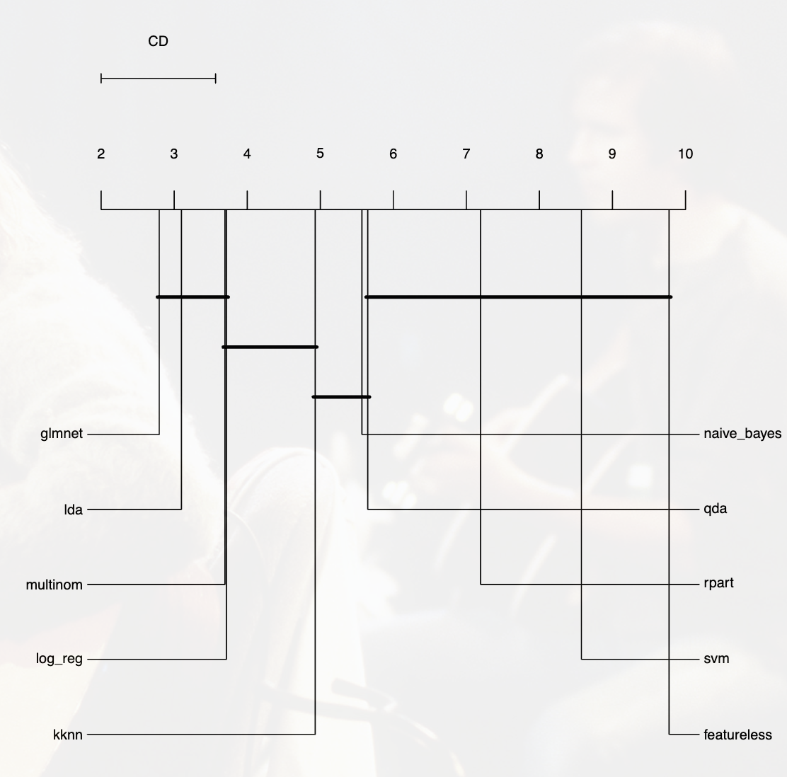
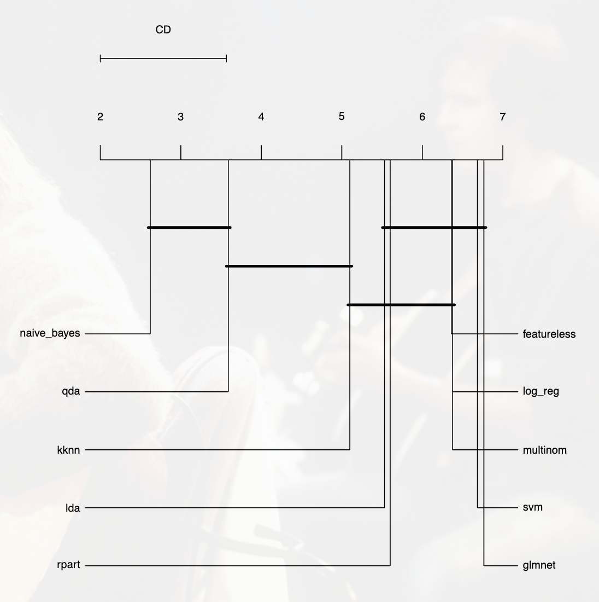
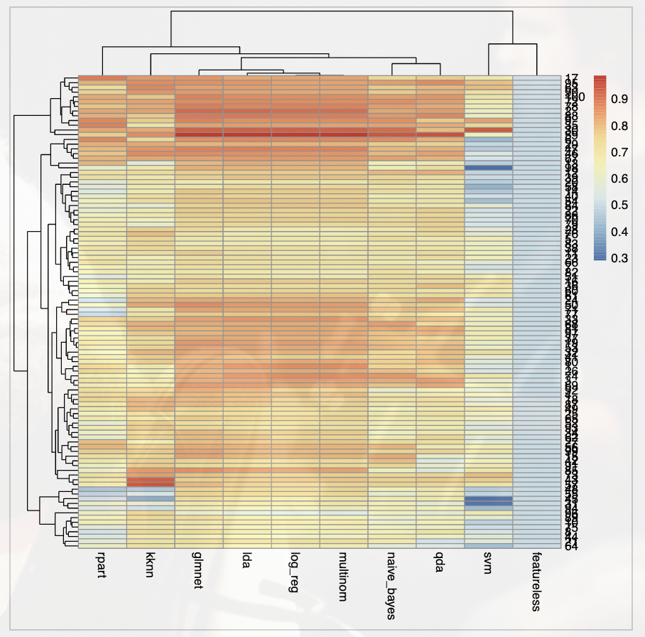
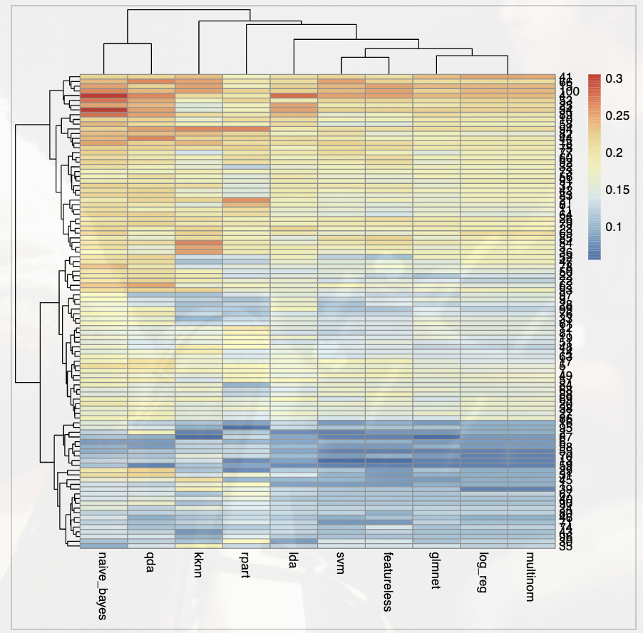

# Practice3

---


## `install_library.r`安装依赖库

`./install_library.r`脚本用于下载`./main.r`脚本中函数所用到的库文件。

```R
install.packages("readr")
install.packages("psych")
install.packages("e1071")
install.packages("tidyverse")
install.packages("dplyr")
install.packages("caret")
install.packages("klaR")
install.packages("kernlab")
install.packages("gbm")
install.packages("mlr3")
install.packages("mlr3verse")
install.packages("pheatmap")
install.packages("kknn")
install.packages("glmnet")
install.packages("Hmisc")
install.packages("devtools")
```

安装包时出现错误*：

```shell
Error in contrib.url(repos, "source") : 试试在不设定镜像的情况下用CRAN Calls: 
install.packages -> contrib.url 停止执行
```

可能是由于R在尝试从默认的CRAN镜像站点下载包时遇到了问题。尝试更改CRAN镜像站点。

```R
options(repos = structure(c(CRAN = "https://cran.rstudio.com/")))
```


---


## `main.r`主程序


---


### 下载数据集

通过`download.file`函数从URL下载文件。

下载前通过`file.exists`判断是否已有目标数据集，防止重复下载。

```R
destfile <- "xalan-2.4.csv"
if(file.exists(destfile)){
  print("Dataset already exists")
} else {
  url <- "https://zenodo.org/record/268436/files/xalan-2.4.csv"
  download.file(url, destfile)
}
```


---


### 任务a

描述性统计：最小值、25%处值、中位值、75%处值、最大值、平均值、偏度(skewness)和峰度(kurtosis)

```R
desc_stats <- tibble(
    variables = variables,
    min = sapply(data[variables], min),
    `1st Qu` = sapply(data[variables], quantile, 0.25),
    median = sapply(data[variables], median),
    mean = sapply(data[variables], mean),
    `3rd Qu` = sapply(data[variables], quantile, 0.75),
    max = sapply(data[variables], max),
    skewness = sapply(data[variables], skewness),
    kurtosis = sapply(data[variables], kurtosis),
)
```

结果通过`write.csv(desc_stats, "result_a.csv", *row.names* = FALSE)`函数写入到`result_a.csv`文件中。如下：

```shell
"variables","min","1st Qu","median","mean","3rd Qu","max","skewness","kurtosis"
"wmc",0,3,6,11.4495159059474,12.5,123,3.47098836957836,15.0362240505368
"dit",1,1,2,2.56569847856155,4,8,0.655504819974644,-0.306614489286725
"noc",0,0,0,0.608575380359613,0,29,7.3171155616407,62.9852124140953
"cbo",0,4,8,14.4979253112033,18,171,3.46485497594133,16.3574051058002
"rfc",0,8,19,30.1618257261411,41,355,3.008470365213,14.570494751981
"lcom",0,0,3,130.081604426003,22.5,6589,7.66843997035903,66.9399610908969
```


---


### 任务b

```R
correrlation <- tibble(
  variables = variables,
  `spearman with "bug"` = sapply(data[variables], function(x) cor.test(x, data[,"bug"], method = "spearman", exact=FALSE)$estimate),
  `pearson with "bug"` = sapply(data[variables], function(x) cor.test(x, data[,"bug"], method = "pearson", exact=FALSE)$estimate),
  `spearman p-value` = sapply(data[variables], function(x) cor.test(x, data[,"bug"], method = "spearman", exact=FALSE)$p.value),
  `pearson p-value` = sapply(data[variables], function(x) cor.test(x, data[,"bug"], method = "pearson", exact=FALSE)$p.value),
)

write.csv(correrlation, "result_b.csv", row.names = FALSE)
```

结果如下：

```shell
"variables","spearman with ""bug""","pearson with ""bug""","spearman p-value","pearson p-value"
"wmc",0.314245033897024,0.378792310824445,4.92001760478498e-18,4.38648754228633e-26
"dit",-0.026123015701173,-0.00186037210932468,0.483105094456787,0.960173069506416
"noc",0.0909442593598713,0.0549159990641536,0.0144367314952927,0.140165251658176
"cbo",0.217623951145338,0.223544214105094,3.36961906023467e-09,1.22089017511793e-09
"rfc",0.356341649438804,0.459293644174618,4.53161841385949e-23,5.18280073436816e-39
"lcom",0.25925161656148,0.307575722358323,1.43874426253669e-12,2.6291022819804e-17
```


---


### 任务c

利用Naïve Bayes和logistic回归等10种机器学习方法建立多变量的缺陷预测模型，不需要进行特征选择。

将数据应用于分类模型中，首先需要对数据集的bug列进行二值化，并转换为factor类型。然后准备输入模型的数据。

```R
# 首先对数据集的bug列进行二值化
data$bug <- ifelse(data$bug > 0, 1, 0)
# naive bayes是分类模型，要把bug列转换为factor类型
data$bug <- as.factor(data$bug)
# 输入模型数据
data <- subset(data, select=c("wmc", "dit", "noc", "cbo", "rfc", "lcom", "bug"))
```

```R
tasks = as_task_classif(data, target = "bug", id = "func")
models = c(
    "classif.naive_bayes", 
    "classif.log_reg",
    "classif.glmnet",
    "classif.multinom",
    "classif.qda",
    "classif.rpart",
    "classif.svm",
    "classif.lda",
    "classif.kknn",
    "classif.featureless")
learners = lrns(models, predict_type = "prob", predict_sets = c("test"))
```


---


### 任务d

进行10x10交叉验证

```R
# 10x10交叉验证
resampling = rsmp("repeated_cv", repeats=10, folds = 10)
design = benchmark_grid(tasks, learners, resampling)
# 运行
bmr = benchmark(design)
```

得到benchmark结果中的auc和ce

```R
# 得到bmr的结果中的auc和ce
keys <- list(msr("classif.auc", id="auc"), msr("classif.ce", id="ce"))
scores <- bmr$score(keys)
scores <- subset(scores, select=c("learner_id", "auc", "ce"))
auc <- data.frame()
ce <- data.frame()
for(i in 0:9){
  for(j in 1:100){
    auc[j, i+1] <- scores[i*100+j, 2]
    ce[j, i+1] <- scores[i*100+j, 3]
  }
}
```

输出结果，写入到`result_d_auc.csv`,  `result_d_ce.csv`文件中。

```shell
"naive_bayes","log_reg","glmnet","multinom","qda","rpart","svm","lda","kknn","featureless"
0.751243781094528,0.863184079601991,0.828358208955224,0.863184079601991,0.771144278606965,0.743781094527363,0.54726368159204,0.855721393034826,0.685323383084576,0.5
0.823383084577114,0.91044776119403,0.912935323383085,0.91044776119403,0.840796019900497,0.82587064676617,0.619402985074627,0.915422885572139,0.830845771144279,0.5
0.817191283292978,0.836561743341404,0.820823244552058,0.836561743341404,0.845036319612591,0.702179176755448,0.610169491525424,0.841404358353511,0.693704600484262,0.5
0.685185185185185,0.794238683127572,0.806584362139918,0.794238683127572,0.671810699588478,0.734053497942387,0.63477366255144,0.79835390946502,0.768004115226338,0.5
0.720138888888889,0.68125,0.682638888888889,0.68125,0.679861111111111,0.673611111111111,0.657638888888889,0.675694444444444,0.750694444444444,0.5
0.863736263736263,0.874725274725275,0.858241758241759,0.874725274725275,0.813186813186813,0.872527472527473,0.424175824175824,0.872527472527473,0.731868131868132,0.5
0.711864406779661,0.692307692307692,0.704693611473272,0.692307692307692,0.692307692307692,0.647979139504563,0.51890482398957,0.704041720990874,0.662972620599739,0.5
0.655737704918033,0.673621460506706,0.72876304023845,0.673621460506706,0.697466467958271,0.515648286140089,0.532041728763041,0.690014903129657,0.730998509687034,0.5
0.856451612903226,0.862903225806452,0.879838709677419,0.862903225806452,0.767741935483871,0.870967741935484,0.832258064516129,0.861290322580645,0.765322580645162,0.5
0.599739243807041,0.6870925684485,0.691655801825294,0.6870925684485,0.642764015645372,0.649282920469361,0.483702737940026,0.69361147327249,0.702086049543677,0.5
0.693548387096774,0.68475073313783,0.766862170087977,0.686217008797654,0.727272727272727,0.675953079178886,0.643695014662756,0.71407624633431,0.718475073313783,0.5
0.793650793650794,0.766666666666667,0.761111111111111,0.766666666666667,0.80952380952381,0.707936507936508,0.488888888888889,0.765079365079365,0.724603174603175,0.5
0.652173913043478,0.811594202898551,0.793478260869566,0.811594202898551,0.666666666666668,0.806159420289855,0.47463768115942,0.815217391304348,0.579710144927535,0.5
0.716129032258065,0.770967741935483,0.775806451612903,0.770967741935483,0.690322580645162,0.554032258064516,0.458064516129032,0.770967741935483,0.673387096774194,0.5
0.813786008230453,0.806584362139918,0.830246913580247,0.806584362139918,0.594650205761317,0.704218106995885,0.606995884773662,0.803497942386831,0.755658436213992,0.5
0.735164835164835,0.768131868131868,0.771428571428571,0.768131868131868,0.73076923076923,0.683516483516484,0.728571428571429,0.772527472527473,0.665934065934066,0.5
0.740547588005215,0.833116036505867,0.848761408083442,0.833116036505867,0.767926988265971,0.885919165580183,0.680573663624511,0.821382007822686,0.845501955671447,0.5
0.697076023391812,0.761403508771929,0.8,0.761403508771929,0.715789473684211,0.750877192982456,0.568421052631579,0.785964912280702,0.813450292397661,0.5
0.788709677419355,0.838709677419355,0.841935483870968,0.838709677419355,0.78225806451613,0.699193548387097,0.617741935483871,0.832258064516129,0.741935483870968,0.5
0.741666666666667,0.686111111111111,0.660416666666666,0.686111111111111,0.675,0.572222222222222,0.472222222222223,0.675,0.691666666666666,0.5
0.674358974358974,0.72948717948718,0.717948717948718,0.72948717948718,0.514102564102564,0.572435897435898,0.569230769230769,0.716666666666667,0.703205128205128,0.5
0.736111111111111,0.756944444444444,0.769097222222222,0.756944444444444,0.762152777777778,0.594618055555556,0.517361111111111,0.763888888888889,0.664930555555556,0.5
0.683333333333333,0.692307692307692,0.711538461538462,0.692307692307692,0.72051282051282,0.684615384615385,0.634615384615385,0.716666666666667,0.65,0.5
0.784832451499118,0.81305114638448,0.825396825396826,0.81305114638448,0.81657848324515,0.513227513227513,0.529100529100529,0.821869488536155,0.792768959435626,0.5
0.679802955665024,0.735221674876847,0.725985221674877,0.735221674876847,0.704433497536946,0.633620689655172,0.623152709359606,0.736453201970443,0.740147783251231,0.5
0.790643274853801,0.825730994152047,0.809356725146199,0.825730994152047,0.750877192982456,0.747953216374269,0.539181286549708,0.824561403508772,0.664327485380117,0.5
0.724292101341281,0.773472429210134,0.786885245901639,0.773472429210134,0.709388971684054,0.789865871833085,0.59016393442623,0.774962742175857,0.671385991058122,0.5
0.674193548387097,0.661290322580645,0.735483870967742,0.661290322580645,0.746774193548387,0.678225806451613,0.57741935483871,0.679032258064516,0.758064516129032,0.5
0.765151515151516,0.803030303030303,0.805555555555555,0.803030303030303,0.752525252525253,0.808080808080809,0.494949494949495,0.813131313131313,0.815656565656566,0.5
0.911290322580645,0.929032258064516,0.930645161290322,0.929032258064516,0.787096774193548,0.82741935483871,0.933870967741935,0.929032258064516,0.816935483870968,0.5
0.634328358208955,0.681592039800995,0.675373134328358,0.681592039800995,0.597014925373134,0.599502487562188,0.308457711442787,0.689054726368159,0.578358208955225,0.5
0.7409200968523,0.809927360774819,0.834140435835351,0.809927360774819,0.788135593220339,0.626513317191283,0.709443099273607,0.825665859564165,0.805690072639225,0.5
0.785714285714285,0.849206349206349,0.834126984126984,0.849206349206349,0.796825396825397,0.765873015873016,0.646031746031746,0.850793650793651,0.76031746031746,0.5
0.625,0.765625,0.797991071428572,0.765625,0.667410714285714,0.631696428571428,0.618303571428572,0.768973214285714,0.74609375,0.5
0.833870967741935,0.833870967741935,0.833870967741935,0.833870967741935,0.819354838709678,0.881451612903226,0.741935483870968,0.837096774193548,0.689516129032258,0.5
0.732724902216427,0.710560625814863,0.735332464146024,0.710560625814863,0.791395045632333,0.634289439374185,0.70013037809648,0.720990873533246,0.739895697522816,0.5
0.779556650246305,0.807881773399015,0.820197044334976,0.807881773399015,0.757389162561577,0.685344827586207,0.652709359605912,0.815270935960591,0.727216748768473,0.5
0.705663189269746,0.710134128166915,0.695976154992548,0.710134128166915,0.687779433681073,0.695230998509687,0.626676602086438,0.714605067064083,0.738450074515649,0.5
0.740234375,0.783203125,0.763671875,0.783203125,0.716796875,0.71484375,0.5,0.78125,0.6767578125,0.5
0.66015625,0.751953125,0.771484375,0.751953125,0.671875,0.60546875,0.513671875,0.74609375,0.7119140625,0.5
0.740229885057471,0.766666666666667,0.810344827586207,0.766666666666667,0.779310344827586,0.68735632183908,0.598850574712644,0.790804597701149,0.767816091954023,0.5
0.786924939467312,0.732445520581114,0.753026634382566,0.732445520581114,0.569007263922518,0.686440677966102,0.63680387409201,0.731234866828087,0.758474576271186,0.5
0.755208333333333,0.774305555555556,0.759548611111111,0.774305555555556,0.769097222222222,0.6875,0.758680555555556,0.765625,0.926215277777778,0.5
0.661016949152542,0.629726205997393,0.647979139504563,0.629726205997393,0.628422425032595,0.544980443285528,0.57496740547588,0.646675358539765,0.670143415906128,0.5
0.661616161616161,0.68939393939394,0.724747474747475,0.68939393939394,0.676767676767677,0.507575757575758,0.303030303030303,0.707070707070707,0.395202020202021,0.5
0.798828125,0.849609375,0.869140625,0.849609375,0.830078125,0.7763671875,0.546875,0.859375,0.8671875,0.5
0.797317436661699,0.882265275707899,0.880774962742176,0.882265275707899,0.812220566318926,0.797317436661699,0.464977645305514,0.883755588673621,0.852459016393442,0.5
0.640322580645162,0.754838709677419,0.754838709677419,0.754838709677419,0.677419354838709,0.445967741935484,0.470967741935484,0.754838709677419,0.464516129032258,0.5
0.638852672750978,0.739243807040417,0.75619295958279,0.739243807040417,0.671447196870926,0.686440677966102,0.680573663624511,0.739243807040417,0.802477183833116,0.5
0.767511177347243,0.837555886736215,0.86736214605067,0.837555886736215,0.763040238450075,0.634873323397914,0.548435171385991,0.843517138599106,0.826378539493294,0.5
0.727272727272727,0.665689149560117,0.71407624633431,0.665689149560117,0.743401759530792,0.562316715542522,0.673020527859238,0.680351906158358,0.651759530791789,0.5
0.663461538461538,0.721153846153846,0.721153846153846,0.721153846153846,0.663461538461538,0.592307692307692,0.584615384615384,0.725,0.765384615384615,0.5
0.794956140350877,0.824561403508772,0.841008771929824,0.824561403508772,0.798245614035088,0.681469298245614,0.619517543859649,0.832236842105263,0.751644736842105,0.5
0.685380116959064,0.774269005847953,0.783625730994152,0.774269005847953,0.698245614035088,0.646198830409357,0.437426900584795,0.778947368421052,0.71812865497076,0.5
0.591044776119404,0.73731343283582,0.755223880597015,0.73731343283582,0.66268656716418,0.482089552238806,0.486567164179104,0.749253731343283,0.528358208955224,0.5
0.802777777777778,0.804166666666667,0.816666666666666,0.804166666666667,0.6625,0.801388888888889,0.654166666666667,0.809722222222222,0.758333333333333,0.5
0.754166666666666,0.751388888888889,0.795833333333333,0.751388888888889,0.743055555555555,0.672222222222222,0.701388888888889,0.766666666666667,0.939583333333333,0.5
0.692995529061103,0.737704918032787,0.687034277198211,0.737704918032787,0.690014903129657,0.580476900149031,0.414307004470939,0.733233979135618,0.663934426229508,0.5
0.943283582089552,0.988059701492537,0.985074626865672,0.988059701492537,0.946268656716418,0.76268656716418,0.641791044776119,0.988059701492537,0.864179104477611,0.5
0.741520467836258,0.747368421052631,0.728654970760234,0.747368421052631,0.693567251461988,0.639766081871345,0.676023391812865,0.742690058479532,0.76140350877193,0.5
0.712698412698413,0.779365079365079,0.768253968253968,0.779365079365079,0.736507936507937,0.598412698412698,0.688888888888889,0.777777777777778,0.765079365079365,0.5
0.657103825136612,0.748633879781421,0.797814207650273,0.748633879781421,0.739071038251366,0.590846994535519,0.575136612021858,0.780054644808743,0.763661202185792,0.5
0.771260997067449,0.828445747800586,0.832844574780059,0.828445747800586,0.794721407624634,0.712609970674487,0.790322580645161,0.837243401759531,0.870967741935484,0.5
0.57258064516129,0.666129032258065,0.679032258064516,0.666129032258065,0.541935483870968,0.606451612903226,0.438709677419355,0.659677419354838,0.695967741935483,0.5
0.675694444444444,0.753472222222222,0.767361111111111,0.753472222222222,0.684027777777778,0.675,0.622916666666667,0.752083333333333,0.70625,0.5
0.6640625,0.715401785714286,0.7421875,0.715401785714286,0.628348214285714,0.720424107142857,0.582589285714286,0.7109375,0.666852678571428,0.5
0.830078125,0.84765625,0.83203125,0.84765625,0.806640625,0.80078125,0.525390625,0.841796875,0.8251953125,0.5
0.8375,0.815277777777778,0.816666666666666,0.815277777777778,0.756944444444445,0.75,0.613888888888888,0.818055555555556,0.809722222222222,0.5
0.779166666666667,0.829166666666667,0.849305555555556,0.829166666666667,0.831944444444444,0.663194444444445,0.633333333333333,0.85,0.679861111111111,0.5
0.740659340659341,0.767032967032967,0.737362637362637,0.767032967032967,0.758241758241758,0.647252747252747,0.525274725274725,0.762637362637363,0.634065934065934,0.5
0.798507462686568,0.833333333333333,0.828358208955224,0.833333333333333,0.796019900497512,0.519900497512438,0.67910447761194,0.825870646766168,0.694029850746269,0.5
0.860703812316716,0.865102639296188,0.863636363636364,0.865102639296188,0.840175953079179,0.809384164222874,0.656891495601173,0.86950146627566,0.834310850439883,0.5
0.735897435897436,0.76025641025641,0.781410256410256,0.76025641025641,0.75,0.707692307692308,0.785897435897436,0.767948717948718,0.83525641025641,0.5
0.85,0.866129032258065,0.821774193548387,0.866129032258065,0.804838709677419,0.660483870967742,0.685483870967742,0.861290322580645,0.66774193548387,0.5
0.626900584795321,0.661988304093567,0.667251461988304,0.661988304093567,0.619883040935673,0.580701754385965,0.513450292397661,0.665497076023392,0.7,0.5
0.700176366843034,0.673721340388007,0.701940035273368,0.673721340388007,0.724867724867725,0.696649029982364,0.582010582010582,0.673721340388007,0.791005291005291,0.5
0.719687092568448,0.783572359843546,0.766623207301173,0.783572359843546,0.70013037809648,0.491525423728813,0.604954367666232,0.774445893089961,0.701434159061278,0.5
0.836111111111111,0.883333333333333,0.884027777777778,0.883333333333333,0.819444444444445,0.772222222222222,0.656944444444444,0.873611111111111,0.814583333333333,0.5
0.738916256157635,0.731527093596059,0.745689655172414,0.731527093596059,0.754926108374384,0.676108374384236,0.527093596059113,0.741379310344828,0.597290640394088,0.5
0.76923076923077,0.821978021978022,0.812087912087912,0.821978021978022,0.806593406593406,0.681318681318681,0.567032967032967,0.815384615384616,0.76923076923077,0.5
0.823809523809524,0.82063492063492,0.805555555555556,0.82063492063492,0.826984126984127,0.688095238095238,0.66031746031746,0.814285714285715,0.805555555555556,0.5
0.702185792349727,0.673497267759563,0.687158469945355,0.673497267759563,0.651639344262295,0.66188524590164,0.565573770491804,0.680327868852459,0.669398907103825,0.5
0.670765027322405,0.659836065573771,0.666666666666667,0.659836065573771,0.6775956284153,0.658469945355191,0.621584699453552,0.670765027322405,0.747267759562842,0.5
0.702682563338301,0.778688524590164,0.754843517138599,0.778688524590164,0.678837555886737,0.609538002980626,0.583457526080477,0.765275707898659,0.593889716840536,0.5
0.622767857142857,0.832589285714286,0.862165178571428,0.832589285714286,0.555803571428572,0.606584821428572,0.685267857142857,0.840401785714286,0.844866071428572,0.5
0.708064516129032,0.746774193548387,0.758870967741935,0.746774193548387,0.737096774193548,0.640322580645162,0.538709677419355,0.746774193548387,0.679838709677419,0.5
0.683582089552239,0.761194029850746,0.8,0.761194029850746,0.71044776119403,0.683582089552239,0.602985074626865,0.779104477611941,0.808955223880596,0.5
0.846153846153846,0.887874837027379,0.893089960886571,0.887874837027379,0.8748370273794,0.807040417209909,0.621903520208605,0.897001303780965,0.767275097783573,0.5
0.60625814863103,0.671447196870926,0.717079530638853,0.671447196870926,0.631029986962191,0.636897001303781,0.586701434159062,0.680573663624511,0.732724902216427,0.5
0.767578125,0.82421875,0.84765625,0.82421875,0.806640625,0.751953125,0.703125,0.830078125,0.85546875,0.5
0.747267759562842,0.741803278688524,0.730191256830601,0.741803278688524,0.594262295081967,0.625,0.665300546448088,0.734972677595628,0.771174863387978,0.5
0.590804597701149,0.762068965517241,0.824137931034483,0.762068965517241,0.627586206896552,0.720689655172414,0.582758620689655,0.811494252873563,0.752873563218391,0.5
0.646627565982404,0.712609970674487,0.739736070381232,0.712609970674487,0.671554252199414,0.661290322580645,0.538123167155425,0.714076246334311,0.771994134897361,0.5
0.648538011695906,0.664912280701754,0.669590643274854,0.664912280701754,0.633333333333333,0.549122807017544,0.435672514619883,0.66140350877193,0.508771929824561,0.5
0.837890625,0.83203125,0.857421875,0.83203125,0.865234375,0.810546875,0.78125,0.8515625,0.869140625,0.5
0.62890625,0.544921875,0.6005859375,0.544921875,0.58984375,0.6103515625,0.671875,0.556640625,0.744140625,0.5
0.786596119929453,0.821869488536155,0.802469135802469,0.82363315696649,0.811287477954145,0.665784832451499,0.654320987654321,0.814814814814814,0.768077601410935,0.5
0.646464646464646,0.800505050505051,0.813131313131313,0.800505050505051,0.714646464646465,0.592171717171717,0.29040404040404,0.803030303030303,0.67929292929293,0.5
0.75,0.796875,0.830078125,0.796875,0.748046875,0.7646484375,0.6875,0.802734375,0.7666015625,0.5
0.839506172839506,0.869341563786008,0.877572016460905,0.869341563786008,0.848765432098766,0.813786008230453,0.688271604938271,0.869341563786008,0.77417695473251,0.5

```

```shell
"naive_bayes","log_reg","glmnet","multinom","qda","rpart","svm","lda","kknn","featureless"
0.136986301369863,0.0958904109589041,0.0958904109589041,0.0958904109589041,0.123287671232877,0.178082191780822,0.0821917808219178,0.0821917808219178,0.164383561643836,0.0821917808219178
0.123287671232877,0.0958904109589041,0.0821917808219178,0.0958904109589041,0.178082191780822,0.10958904109589,0.0684931506849315,0.0684931506849315,0.0684931506849315,0.0821917808219178
0.205479452054795,0.178082191780822,0.164383561643836,0.178082191780822,0.164383561643836,0.191780821917808,0.178082191780822,0.191780821917808,0.246575342465753,0.191780821917808
0.305555555555556,0.236111111111111,0.236111111111111,0.236111111111111,0.263888888888889,0.194444444444444,0.25,0.277777777777778,0.208333333333333,0.25
0.208333333333333,0.152777777777778,0.152777777777778,0.152777777777778,0.208333333333333,0.180555555555556,0.166666666666667,0.166666666666667,0.166666666666667,0.166666666666667
0.0833333333333333,0.0833333333333333,0.0833333333333333,0.0833333333333333,0.0833333333333333,0.0972222222222222,0.0972222222222222,0.0833333333333333,0.125,0.0972222222222222
0.180555555555556,0.152777777777778,0.166666666666667,0.152777777777778,0.194444444444444,0.180555555555556,0.166666666666667,0.166666666666667,0.180555555555556,0.180555555555556
0.208333333333333,0.166666666666667,0.166666666666667,0.166666666666667,0.194444444444444,0.236111111111111,0.166666666666667,0.180555555555556,0.152777777777778,0.152777777777778
0.180555555555556,0.152777777777778,0.152777777777778,0.152777777777778,0.138888888888889,0.111111111111111,0.125,0.166666666666667,0.125,0.138888888888889
0.222222222222222,0.194444444444444,0.194444444444444,0.194444444444444,0.222222222222222,0.208333333333333,0.180555555555556,0.208333333333333,0.166666666666667,0.180555555555556
0.205479452054795,0.164383561643836,0.164383561643836,0.164383561643836,0.178082191780822,0.205479452054795,0.164383561643836,0.164383561643836,0.191780821917808,0.150684931506849
0.164383561643836,0.150684931506849,0.150684931506849,0.150684931506849,0.150684931506849,0.205479452054795,0.136986301369863,0.150684931506849,0.164383561643836,0.136986301369863
0.123287671232877,0.0684931506849315,0.0684931506849315,0.0684931506849315,0.123287671232877,0.0684931506849315,0.0547945205479452,0.0821917808219178,0.136986301369863,0.0547945205479452
0.152777777777778,0.138888888888889,0.138888888888889,0.138888888888889,0.166666666666667,0.138888888888889,0.138888888888889,0.152777777777778,0.194444444444444,0.138888888888889
0.25,0.236111111111111,0.236111111111111,0.236111111111111,0.222222222222222,0.180555555555556,0.236111111111111,0.222222222222222,0.25,0.25
0.152777777777778,0.0972222222222222,0.0833333333333333,0.0972222222222222,0.125,0.0833333333333333,0.0833333333333333,0.125,0.111111111111111,0.0972222222222222
0.180555555555556,0.138888888888889,0.152777777777778,0.138888888888889,0.208333333333333,0.152777777777778,0.180555555555556,0.166666666666667,0.166666666666667,0.180555555555556
0.25,0.194444444444444,0.194444444444444,0.194444444444444,0.222222222222222,0.208333333333333,0.222222222222222,0.208333333333333,0.236111111111111,0.208333333333333
0.166666666666667,0.138888888888889,0.152777777777778,0.138888888888889,0.152777777777778,0.180555555555556,0.138888888888889,0.166666666666667,0.166666666666667,0.138888888888889
0.194444444444444,0.166666666666667,0.152777777777778,0.166666666666667,0.180555555555556,0.152777777777778,0.166666666666667,0.152777777777778,0.152777777777778,0.166666666666667
0.191780821917808,0.178082191780822,0.164383561643836,0.178082191780822,0.219178082191781,0.26027397260274,0.164383561643836,0.178082191780822,0.219178082191781,0.178082191780822
0.205479452054795,0.136986301369863,0.10958904109589,0.136986301369863,0.205479452054795,0.136986301369863,0.150684931506849,0.150684931506849,0.191780821917808,0.123287671232877
0.219178082191781,0.191780821917808,0.191780821917808,0.191780821917808,0.191780821917808,0.178082191780822,0.178082191780822,0.219178082191781,0.219178082191781,0.178082191780822
0.152777777777778,0.125,0.125,0.125,0.125,0.138888888888889,0.125,0.125,0.152777777777778,0.125
0.25,0.208333333333333,0.194444444444444,0.208333333333333,0.236111111111111,0.180555555555556,0.194444444444444,0.25,0.152777777777778,0.194444444444444
0.194444444444444,0.194444444444444,0.194444444444444,0.194444444444444,0.208333333333333,0.180555555555556,0.194444444444444,0.180555555555556,0.208333333333333,0.208333333333333
0.166666666666667,0.152777777777778,0.166666666666667,0.152777777777778,0.180555555555556,0.138888888888889,0.152777777777778,0.166666666666667,0.152777777777778,0.152777777777778
0.166666666666667,0.138888888888889,0.125,0.138888888888889,0.138888888888889,0.125,0.111111111111111,0.166666666666667,0.111111111111111,0.138888888888889
0.194444444444444,0.0972222222222222,0.111111111111111,0.0972222222222222,0.222222222222222,0.0694444444444444,0.111111111111111,0.111111111111111,0.111111111111111,0.0833333333333333
0.111111111111111,0.125,0.111111111111111,0.125,0.125,0.180555555555556,0.138888888888889,0.0833333333333333,0.111111111111111,0.138888888888889
0.205479452054795,0.0958904109589041,0.0958904109589041,0.0958904109589041,0.219178082191781,0.164383561643836,0.0958904109589041,0.136986301369863,0.136986301369863,0.0821917808219178
0.205479452054795,0.178082191780822,0.178082191780822,0.178082191780822,0.178082191780822,0.123287671232877,0.178082191780822,0.164383561643836,0.164383561643836,0.191780821917808
0.164383561643836,0.150684931506849,0.150684931506849,0.150684931506849,0.164383561643836,0.123287671232877,0.136986301369863,0.150684931506849,0.0958904109589041,0.136986301369863
0.305555555555556,0.222222222222222,0.222222222222222,0.222222222222222,0.25,0.180555555555556,0.222222222222222,0.25,0.152777777777778,0.222222222222222
0.0972222222222222,0.125,0.138888888888889,0.125,0.138888888888889,0.125,0.138888888888889,0.125,0.180555555555556,0.138888888888889
0.180555555555556,0.180555555555556,0.180555555555556,0.180555555555556,0.166666666666667,0.194444444444444,0.166666666666667,0.180555555555556,0.25,0.180555555555556
0.222222222222222,0.180555555555556,0.166666666666667,0.180555555555556,0.208333333333333,0.152777777777778,0.194444444444444,0.194444444444444,0.208333333333333,0.194444444444444
0.166666666666667,0.166666666666667,0.152777777777778,0.166666666666667,0.166666666666667,0.166666666666667,0.152777777777778,0.152777777777778,0.152777777777778,0.152777777777778
0.138888888888889,0.0694444444444444,0.111111111111111,0.0694444444444444,0.138888888888889,0.152777777777778,0.111111111111111,0.125,0.180555555555556,0.111111111111111
0.138888888888889,0.111111111111111,0.111111111111111,0.111111111111111,0.152777777777778,0.152777777777778,0.111111111111111,0.111111111111111,0.138888888888889,0.111111111111111
0.219178082191781,0.246575342465753,0.232876712328767,0.246575342465753,0.219178082191781,0.178082191780822,0.219178082191781,0.205479452054795,0.232876712328767,0.205479452054795
0.205479452054795,0.178082191780822,0.178082191780822,0.178082191780822,0.219178082191781,0.150684931506849,0.178082191780822,0.191780821917808,0.164383561643836,0.191780821917808
0.136986301369863,0.10958904109589,0.10958904109589,0.10958904109589,0.123287671232877,0.123287671232877,0.10958904109589,0.123287671232877,0.0821917808219178,0.123287671232877
0.236111111111111,0.194444444444444,0.180555555555556,0.194444444444444,0.263888888888889,0.222222222222222,0.194444444444444,0.208333333333333,0.222222222222222,0.180555555555556
0.166666666666667,0.0972222222222222,0.0833333333333333,0.0972222222222222,0.166666666666667,0.0972222222222222,0.0972222222222222,0.0972222222222222,0.208333333333333,0.0833333333333333
0.138888888888889,0.0972222222222222,0.111111111111111,0.0972222222222222,0.0972222222222222,0.125,0.0972222222222222,0.111111111111111,0.111111111111111,0.111111111111111
0.208333333333333,0.180555555555556,0.152777777777778,0.180555555555556,0.208333333333333,0.125,0.152777777777778,0.166666666666667,0.111111111111111,0.152777777777778
0.166666666666667,0.125,0.125,0.125,0.138888888888889,0.180555555555556,0.138888888888889,0.152777777777778,0.194444444444444,0.138888888888889
0.166666666666667,0.166666666666667,0.166666666666667,0.166666666666667,0.166666666666667,0.180555555555556,0.180555555555556,0.152777777777778,0.152777777777778,0.180555555555556
0.208333333333333,0.152777777777778,0.152777777777778,0.152777777777778,0.208333333333333,0.138888888888889,0.152777777777778,0.138888888888889,0.180555555555556,0.152777777777778
0.150684931506849,0.136986301369863,0.136986301369863,0.136986301369863,0.136986301369863,0.178082191780822,0.136986301369863,0.136986301369863,0.150684931506849,0.150684931506849
0.205479452054795,0.178082191780822,0.178082191780822,0.178082191780822,0.219178082191781,0.136986301369863,0.123287671232877,0.178082191780822,0.136986301369863,0.10958904109589
0.273972602739726,0.219178082191781,0.205479452054795,0.219178082191781,0.246575342465753,0.219178082191781,0.219178082191781,0.191780821917808,0.178082191780822,0.219178082191781
0.208333333333333,0.180555555555556,0.194444444444444,0.180555555555556,0.208333333333333,0.194444444444444,0.194444444444444,0.166666666666667,0.263888888888889,0.208333333333333
0.0972222222222222,0.0694444444444444,0.0694444444444444,0.0694444444444444,0.111111111111111,0.125,0.0694444444444444,0.0833333333333333,0.125,0.0694444444444444
0.180555555555556,0.180555555555556,0.180555555555556,0.180555555555556,0.208333333333333,0.152777777777778,0.166666666666667,0.194444444444444,0.180555555555556,0.166666666666667
0.180555555555556,0.166666666666667,0.152777777777778,0.166666666666667,0.194444444444444,0.180555555555556,0.152777777777778,0.180555555555556,0.138888888888889,0.166666666666667
0.236111111111111,0.180555555555556,0.194444444444444,0.180555555555556,0.208333333333333,0.180555555555556,0.152777777777778,0.208333333333333,0.180555555555556,0.152777777777778
0.111111111111111,0.0694444444444444,0.0694444444444444,0.0694444444444444,0.0694444444444444,0.0833333333333333,0.0694444444444444,0.0694444444444444,0.111111111111111,0.0694444444444444
0.208333333333333,0.180555555555556,0.180555555555556,0.180555555555556,0.194444444444444,0.208333333333333,0.194444444444444,0.180555555555556,0.180555555555556,0.208333333333333
0.178082191780822,0.150684931506849,0.164383561643836,0.150684931506849,0.178082191780822,0.136986301369863,0.136986301369863,0.150684931506849,0.123287671232877,0.136986301369863
0.232876712328767,0.150684931506849,0.164383561643836,0.150684931506849,0.246575342465753,0.178082191780822,0.178082191780822,0.164383561643836,0.164383561643836,0.164383561643836
0.178082191780822,0.136986301369863,0.136986301369863,0.136986301369863,0.164383561643836,0.136986301369863,0.136986301369863,0.164383561643836,0.164383561643836,0.150684931506849
0.222222222222222,0.152777777777778,0.166666666666667,0.152777777777778,0.222222222222222,0.208333333333333,0.152777777777778,0.166666666666667,0.194444444444444,0.138888888888889
0.222222222222222,0.208333333333333,0.180555555555556,0.208333333333333,0.180555555555556,0.180555555555556,0.166666666666667,0.194444444444444,0.222222222222222,0.166666666666667
0.236111111111111,0.208333333333333,0.208333333333333,0.208333333333333,0.263888888888889,0.194444444444444,0.25,0.208333333333333,0.25,0.222222222222222
0.138888888888889,0.125,0.111111111111111,0.125,0.138888888888889,0.166666666666667,0.111111111111111,0.125,0.111111111111111,0.111111111111111
0.152777777777778,0.152777777777778,0.166666666666667,0.152777777777778,0.152777777777778,0.125,0.166666666666667,0.138888888888889,0.166666666666667,0.166666666666667
0.180555555555556,0.166666666666667,0.138888888888889,0.166666666666667,0.166666666666667,0.152777777777778,0.138888888888889,0.180555555555556,0.180555555555556,0.166666666666667
0.111111111111111,0.0694444444444444,0.0833333333333333,0.0694444444444444,0.111111111111111,0.125,0.0833333333333333,0.0972222222222222,0.152777777777778,0.0972222222222222
0.123287671232877,0.10958904109589,0.123287671232877,0.10958904109589,0.10958904109589,0.136986301369863,0.0821917808219178,0.123287671232877,0.123287671232877,0.0821917808219178
0.205479452054795,0.123287671232877,0.136986301369863,0.123287671232877,0.219178082191781,0.164383561643836,0.136986301369863,0.164383561643836,0.191780821917808,0.150684931506849
0.178082191780822,0.178082191780822,0.178082191780822,0.178082191780822,0.178082191780822,0.178082191780822,0.178082191780822,0.191780821917808,0.191780821917808,0.178082191780822
0.138888888888889,0.125,0.111111111111111,0.125,0.111111111111111,0.111111111111111,0.111111111111111,0.125,0.111111111111111,0.138888888888889
0.222222222222222,0.194444444444444,0.194444444444444,0.194444444444444,0.222222222222222,0.222222222222222,0.208333333333333,0.180555555555556,0.208333333333333,0.208333333333333
0.180555555555556,0.138888888888889,0.138888888888889,0.138888888888889,0.194444444444444,0.111111111111111,0.125,0.138888888888889,0.125,0.125
0.222222222222222,0.180555555555556,0.152777777777778,0.180555555555556,0.194444444444444,0.194444444444444,0.208333333333333,0.194444444444444,0.138888888888889,0.180555555555556
0.236111111111111,0.166666666666667,0.152777777777778,0.166666666666667,0.194444444444444,0.152777777777778,0.152777777777778,0.152777777777778,0.138888888888889,0.166666666666667
0.208333333333333,0.180555555555556,0.194444444444444,0.180555555555556,0.222222222222222,0.194444444444444,0.194444444444444,0.180555555555556,0.194444444444444,0.194444444444444
0.125,0.125,0.125,0.125,0.125,0.125,0.125,0.125,0.125,0.0972222222222222
0.150684931506849,0.150684931506849,0.150684931506849,0.150684931506849,0.150684931506849,0.191780821917808,0.123287671232877,0.136986301369863,0.150684931506849,0.136986301369863
0.232876712328767,0.164383561643836,0.178082191780822,0.164383561643836,0.232876712328767,0.219178082191781,0.205479452054795,0.178082191780822,0.232876712328767,0.164383561643836
0.219178082191781,0.178082191780822,0.164383561643836,0.178082191780822,0.219178082191781,0.150684931506849,0.164383561643836,0.191780821917808,0.178082191780822,0.164383561643836
0.180555555555556,0.152777777777778,0.152777777777778,0.152777777777778,0.152777777777778,0.0972222222222222,0.166666666666667,0.152777777777778,0.166666666666667,0.152777777777778
0.194444444444444,0.194444444444444,0.166666666666667,0.194444444444444,0.166666666666667,0.180555555555556,0.208333333333333,0.152777777777778,0.208333333333333,0.222222222222222
0.180555555555556,0.166666666666667,0.138888888888889,0.166666666666667,0.180555555555556,0.138888888888889,0.138888888888889,0.152777777777778,0.152777777777778,0.138888888888889
0.111111111111111,0.0833333333333333,0.0555555555555556,0.0833333333333333,0.0972222222222222,0.125,0.0694444444444444,0.0833333333333333,0.0555555555555556,0.0694444444444444
0.152777777777778,0.152777777777778,0.152777777777778,0.152777777777778,0.152777777777778,0.125,0.166666666666667,0.152777777777778,0.152777777777778,0.180555555555556
0.277777777777778,0.194444444444444,0.208333333333333,0.194444444444444,0.25,0.194444444444444,0.166666666666667,0.236111111111111,0.208333333333333,0.180555555555556
0.152777777777778,0.111111111111111,0.111111111111111,0.111111111111111,0.166666666666667,0.138888888888889,0.111111111111111,0.125,0.111111111111111,0.111111111111111
0.191780821917808,0.191780821917808,0.164383561643836,0.191780821917808,0.191780821917808,0.164383561643836,0.178082191780822,0.191780821917808,0.178082191780822,0.164383561643836
0.219178082191781,0.191780821917808,0.164383561643836,0.191780821917808,0.205479452054795,0.205479452054795,0.191780821917808,0.191780821917808,0.164383561643836,0.205479452054795
0.219178082191781,0.178082191780822,0.164383561643836,0.178082191780822,0.219178082191781,0.164383561643836,0.150684931506849,0.164383561643836,0.219178082191781,0.150684931506849
0.222222222222222,0.208333333333333,0.208333333333333,0.208333333333333,0.25,0.263888888888889,0.208333333333333,0.194444444444444,0.263888888888889,0.208333333333333
0.152777777777778,0.0972222222222222,0.111111111111111,0.0972222222222222,0.138888888888889,0.0555555555555556,0.111111111111111,0.125,0.0972222222222222,0.111111111111111
0.138888888888889,0.111111111111111,0.111111111111111,0.111111111111111,0.138888888888889,0.138888888888889,0.111111111111111,0.111111111111111,0.0972222222222222,0.111111111111111
0.180555555555556,0.152777777777778,0.125,0.152777777777778,0.111111111111111,0.138888888888889,0.138888888888889,0.152777777777778,0.111111111111111,0.125
0.0972222222222222,0.0833333333333333,0.0972222222222222,0.0833333333333333,0.0833333333333333,0.125,0.0833333333333333,0.0972222222222222,0.125,0.0833333333333333
0.166666666666667,0.125,0.138888888888889,0.125,0.180555555555556,0.111111111111111,0.111111111111111,0.180555555555556,0.111111111111111,0.111111111111111
0.263888888888889,0.236111111111111,0.222222222222222,0.236111111111111,0.236111111111111,0.222222222222222,0.236111111111111,0.222222222222222,0.25,0.25

```


---


### 任务e

使用plotCD函数绘制模型表现的CD图。plotCD函数需要用scmamp包，但无法直接安装适配最新版本R的包，需要从GitHub上安装

```R
devtools::install_github("b0rxa/scmamp")
library(scmamp)
```

```R
plotCD(results.matrix=auc, alpha=0.01)
plotCD(results.matrix=ce, alpha=0.01)
```

结果保存在`Rplots.pdf`文件中。






---


### 任务f

报错：
```R
Error in as.double(y) : 
  cannot coerce type 'S4' to vector of type 'double'
Calls: drawAlgorithmGraph -> plot -> plot.default -> xy.coords
Execution halted
```
推测Rgraphviz包不兼容新版本（4.3）的R语言


---


### 任务g

使用`pheatmap()`函数绘制热力图

```R
pheatmap(as.matrix(auc))
pheatmap(as.matrix(ce))
```

结果保存在`Rplots.pdf`文件中。





