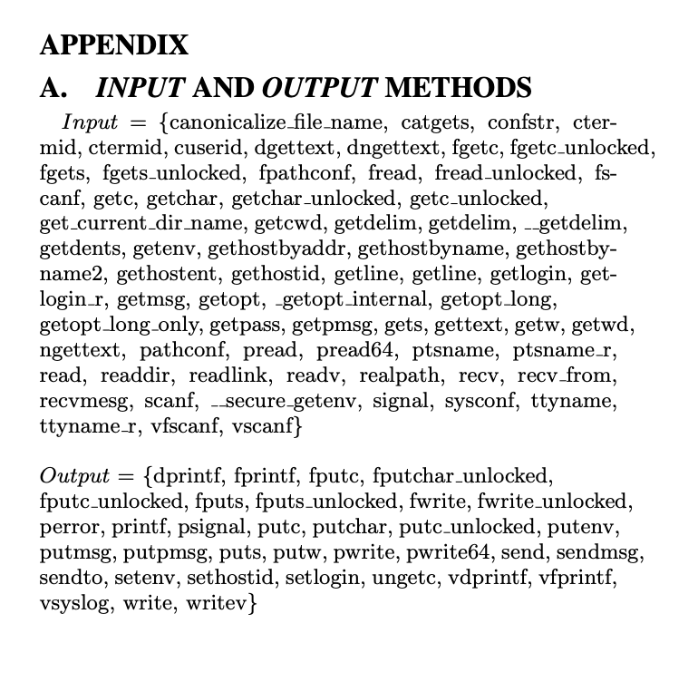

# Practice 5 软件攻击面计算

522023330037 姬怡深

运行脚本：`python main.py`。两个软件中的函数关于dep和dexp的统计结果分别保存在`./data/proftpd.csv`和`./data/wuftpd.csv`中。

参考文献：[Measuring the Attack Surfaces of Two FTP Daemons](https://dl.acm.org/doi/pdf/10.1145/1179494.1179497)

统计所用到的输入和输出方法参考论文附录，如图：

